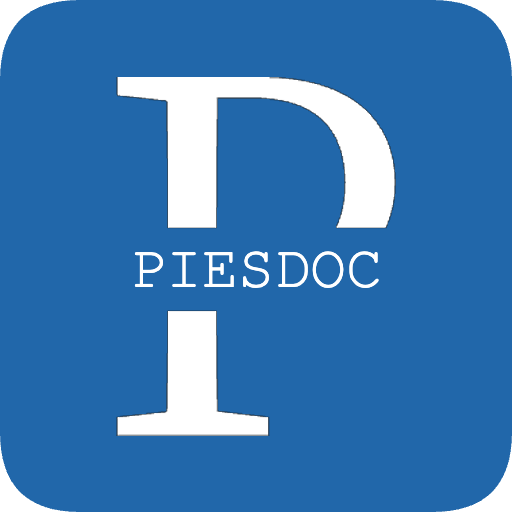

<h1 align="center">Pies Doc</h1>

  
   
   
  
A handbook about the fundamentals of web development.

  <h2>
    <a href="https://piesdoc.com/" target="_blank">Start Reading Now</a>
  </h2>

## Who Is Suitable for Pies Doc?

Pies Doc suits those who have **already learned the very basics of JavaScript**, and **have basic knowledge of the subject they're trying to learn**. If you are an absolute beginner with 0 experience with the subject, you may find the content of this handbook difficult to understand.

But don't worry, you don't need a lot of experience to get started; just follow the official tutorial to make a simple app if there's one, either a todo app or a counter app is fine, then you'll be all set! No matter which level you're at, you can all benefit from this handbook.

## How Can Pies Doc Help You?

Pies Doc explains the fundamentals! Instead of digging into the source code and show you something extremely raw, this handbook emphasizes the part that relates to developers the most — the API itself.

By learning how to use API correctly and the theory behind it, you will not only be able to identify what is anti-pattern, but also significantly reduce the bugs and strange workarounds brought by inappropriate API usage.

**Never underestimate the power of the fundamentals!** Although "to learn the fundamentals well" may not sound very cool and appealing, it is in fact an indispensable element for being able to comprehend more advanced knowledge.

## Why Pies Doc?

Bad code is everywhere. From apps with hundreds of thousands of active users to some random apps you've never heard of, the amount of bad code in this world is way more than you could ever imagine.

Unfortunately, we, the developers, are the source of these bad code. The problem is, most of the developers didn't realize what they wrote is bad, one of the reason is because they didn't learn the fundamentals well enough.

We want to change this. With the help of Pies Doc, a 100% free handbook, we hope that more and more people in this industry will start to care about their code quality, and help eliminate as much bad code as they can.

## Contribution

### Contribution Guide

Work in progress.

### Supporting

We hope you like Pies Doc! Your support will be very appreciated!

.
